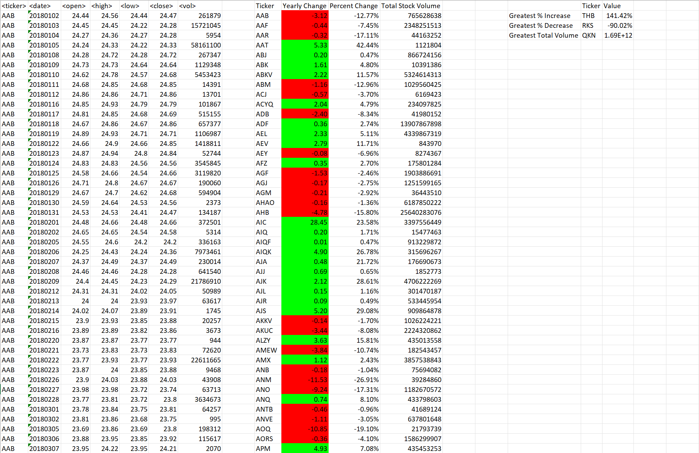
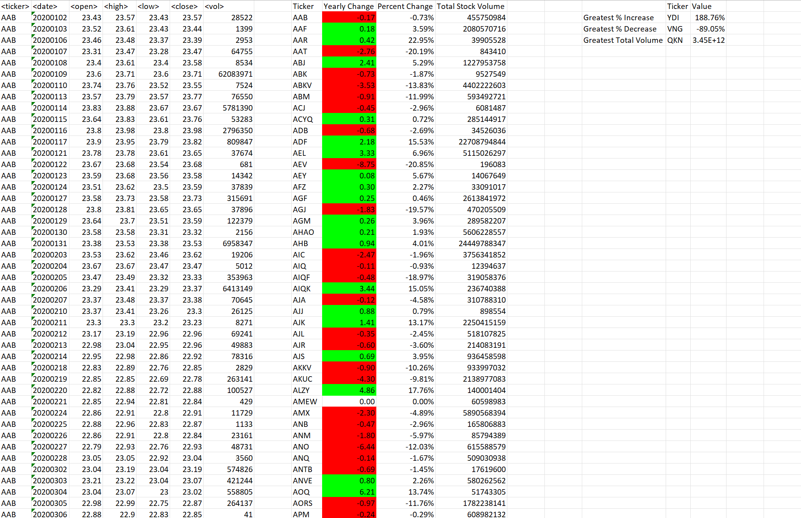

## 1. Overview of Project

This project used Visual Basic for Applications (VBA) programming language to analyze generated more than **750K** stock market data. The results of the analyses provide insights into about **3K** unique stock's ➊ Ticker Symbol, ➋ Yearly Change,➌ Percent Change, and ➍ Total Stock Volume. The analyses will also provide information on the  **"Greatest % increase", "Greatest % decrease", and "Greatest total volume"** .

### a. Objective

Create a script that loops through all the stocks for one year and outputs the following information:

| Main Part              | Bonus                 |
| ---------------------- | --------------------- |
| The ticker symbol      | Greatest % increase   |
| Yearly change          | Greatest % decrease   |
| The percentage change  | Greatest total volume |
| The total stock volume |                       |

### b. Methods and Software

These analyses were performed using VBA in Microsoft Excel, with the Multiple Year Stock Analysis.

## 2. Code

```
For Each ws In Worksheets
  
    Dim Ticker_name As String
    Dim GrInTicker As String
    Dim GrDeTicker As String
    Dim TotVoTicker As String
    Dim Ticker_Summary As Integer
    Dim TotalStockVolume As Double
    Dim Openvalue As Double
    Dim Closevalue As Double
    Dim YearlyChange As Double
    Dim PrecentChange As Double
    Dim GreatestIncrease As Double
    Dim GreatestDecrease As Double
    Dim GreatestTotalVolume As Double
    Dim PercentChangeRange As Range
    Dim YearlyChangeRange As Range
    Set YearlyChangeRange = ws.Range("J:J")
  

    Ticker_Summary = 2
    lastrow = ws.Cells(Rows.Count, 1).End(xlUp).Row
    TotalStockVolume = ws.Cells(2, 7).Value
    Openvalue = ws.Cells(2, 3).Value
    GreatestIncrease = 0
    GreatestDecrease = 0
    GreatestTotalVolume = 0

    ' CORRECT CELLS FORMAT
    ws.Range("K:K").NumberFormat = "0.00%"
    ws.Range("J:J").NumberFormat = "0.00"
    ws.Cells(1, 9).Value = "Ticker"
    ws.Cells(1, 10).Value = "Yearly Change"
    ws.Cells(1, 11).Value = "Percent Change"
    ws.Cells(1, 12).Value = "Total Stock Volume"
    ws.Cells(1, 16).Value = "Ticker"
    ws.Cells(1, 17).Value = "Value"
    ws.Cells(2, 15).Value = "Greatest % Increase"
    ws.Cells(3, 15).Value = "Greatest % Decrease"
    ws.Cells(4, 15).Value = "Greatest Total Volume"

    For i = 2 To lastrow
        If ws.Cells(i + 1, 1).Value <> ws.Cells(i, 1).Value Then
            Ticker_name = ws.Cells(i, 1).Value
            YearlyChange = Closevalue - Openvalue
            PrecentChange = YearlyChange / Openvalue
            ws.Range("I" & Ticker_Summary).Value = Ticker_name
            ws.Range("J" & Ticker_Summary).Value = YearlyChange
            ws.Range("K" & Ticker_Summary).Value = PrecentChange

                'Greatest % Increase & Greatest % Decrease
                If PrecentChange > GreatestIncrease Then
                    GreatestIncrease = PrecentChange
                    GrInTicker = Ticker_name
                ElseIf PrecentChange < GreatestDecrease Then
                    GreatestDecrease = PrecentChange
                    GrDeTicker = Ticker_name
                End If
          
            ws.Range("L" & Ticker_Summary).Value = TotalStockVolume

                'Greatest Total Volume
                If TotalStockVolume > GreatestTotalVolume Then
                    GreatestTotalVolume = TotalStockVolume
                    TotVoTicker = Ticker_name
                End If
      
            TotalStockVolume = ws.Cells(i + 1, 7).Value
            Ticker_Summary = Ticker_Summary + 1
            Openvalue = ws.Cells(i + 1, 3).Value

        ElseIf ws.Cells(i + 1, 1).Value = ws.Cells(i, 1).Value Then
            TotalStockVolume = TotalStockVolume + ws.Cells(i + 1, 7).Value
            Closevalue = ws.Cells(i + 1, 6).Value
        End If

    Next i
    'Yearly Change Column Color (Column J)
    For Each Cell In YearlyChangeRange
        If Cell.Value > 0 Then
            Cell.Interior.ColorIndex = 4
        ElseIf Cell.Value < 0 Then
            Cell.Interior.ColorIndex = 3
        Else
            Cell.Interior.ColorIndex = xlNone
        End If
    Next
    ws.Cells(1, 10).Interior.ColorIndex = xlNone

    ws.Cells(2, 16).Value = GrInTicker
    ws.Cells(3, 16).Value = GrDeTicker
    ws.Cells(4, 16).Value = TotVoTicker
    ws.Cells(2, 17).Value = GreatestIncrease
    ws.Cells(2, 17).NumberFormat = "0.00%"
    ws.Cells(3, 17).Value = GreatestDecrease
    ws.Cells(3, 17).NumberFormat = "0.00%"
    ws.Cells(4, 17).Value = GreatestTotalVolume
    ws.Cells(4, 17).NumberFormat = "0.00E+00"
    'Columns width Autofit
    ws.Columns("A:R").AutoFit
Next
```

## 3. Results

**Stock Performance Comparison:**
**2018:** **THB** had the greatest yearly percent change *increase* of all stocks at 141.42%. and **RKS** had the greatest yearly percent change *decrease* with falling down about 90%. in addition, **QKN** had highest total volume in 3K unique stock trickers with a amount of 1.69x10 ^+12^ .



**2019:** **RYU** had the greatest yearly percent change *increase* of all stocks at 190.03%. and **RKS** had the greatest yearly percent change *decrease* with falling down about 91.6%. in addition, **ZQD** had highest total volume in 3K unique stock trickers with a amount of 4.37x10 ^+12^ .


**2020:** **YDI** had the greatest yearly percent change *increase* of all stocks at 188.76%. and **VNG** had the greatest yearly percent change *decrease* with falling down about 89%. in addition, **QKN** had highest total volume in 3K unique stock trickers with a amount of 3.45x10 ^+12^ .


